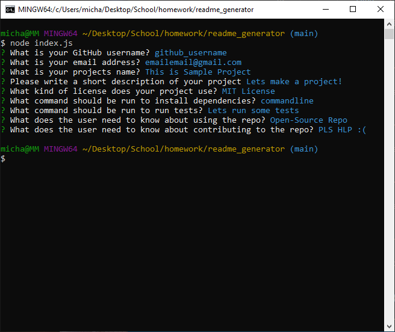
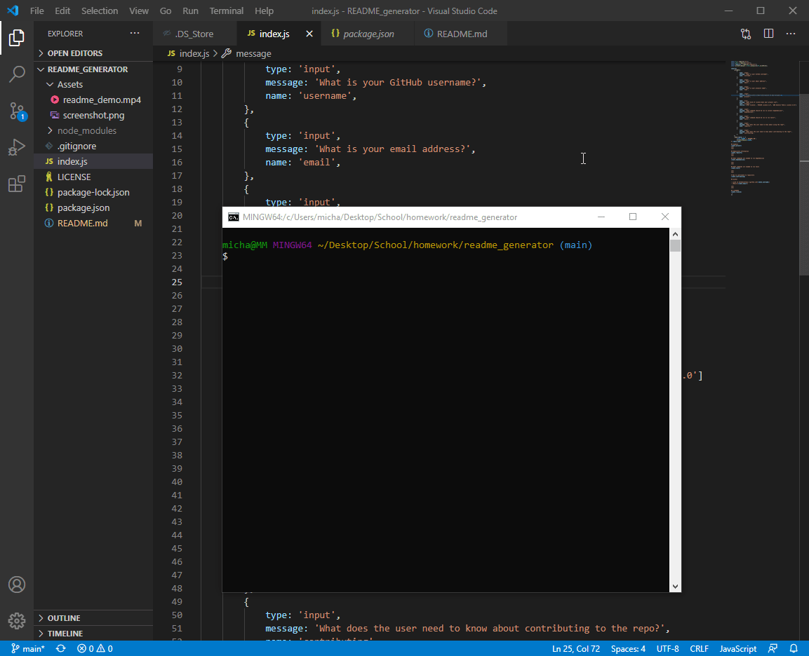

# README_generator
Professional readme.md generator for open-sourced github repositories

## Summary
Intuitive README.MD generator for Open-Sourced Github repositories through the 
terminal/command line. Prompts are generated through the "Inquirer" npm package varrying
from user inputs to lists for users to select an option that fits their needs. 

 
 

## Example 

[Link to Demo Video](https://github.com/michaelanthonyyy/README_generator/blob/main/Assets/readme_demo.mp4)
 
 

## Requirements To Run
The "Inquirer" npm package must be installed for the readme.md generator to function properly.
While in Terminal or GitBash depending on your OS, run the command, "npm install inquirer."
After the "Inquirer" packages have been installed, readme.md generator can be used by running the "node index.js" command. 

 
 

## Built Using

* [Node.js](https://nodejs.org/en/)
* [JSON](https://www.json.org/json-en.html)
* [Inquirer](https://www.npmjs.com/package/inquirer)

 
 

## Author

**Michael Medina** 
- [Link to Github](https://github.com/michaelanthonyyy)
- [Link to LinkedIn](https://www.linkedin.com/in/michael-medina-22aa70200?lipi=urn%3Ali%3Apage%3Ad_flagship3_profile_view_base_contact_details%3B311BosSLTMS4JkhAfkX61A%3D%3D)
- [Link to Portfolio](https://michaelanthonyyy.github.io/portfolio2021/)

 
 

## LICENSES

Copyright (c) 2021 MIT LICENSE